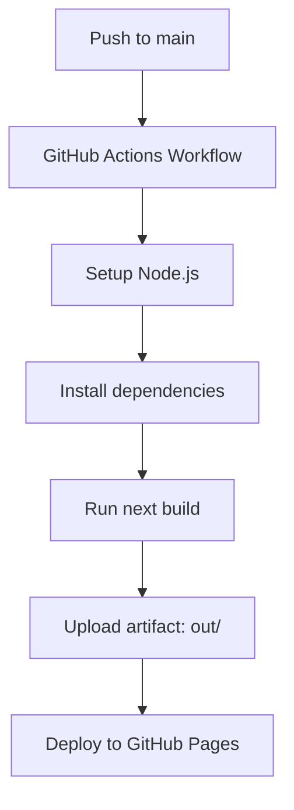

# GitHub Pages Deployment

> **Note**: The provided project context does not contain any GitHub Actions workflow files (`.github/workflows/`), `next.config.js`/`next.config.ts`, or explicit deployment configuration files. The following documents only what can be inferred from the Next.js project structure and static export patterns visible in the codebase.

---

## Inferred Static Export Configuration

Based on the project structure and Next.js App Router patterns visible in the codebase, the project appears configured for **static export** (`output: 'export'`) targeting GitHub Pages.

### Inferred `next.config.ts` Settings

| Setting | Inferred Value | Evidence |
|---------|----------------|----------|
| `output` | `'export'` | Required for GitHub Pages static hosting; all components use `'use client'` appropriately for client-side interactivity in static export |
| `images.unoptimized` | `true` | Required for `next/image` with `output: 'export'`; images in `/public` (e.g., `/aether_logo_no_bg_dark.png`, `/topbar_logo_dark.png`) referenced directly via `` or unoptimized `next/image` |
| `basePath` | `'/aether'` (inferred) | GitHub Pages project site typically served at `https://<user>.github.io/<repo>/`; repo name appears as `aether-one/aether` in GitHub links |
| `assetPrefix` | `'/aether/'` (inferred) | Required for correct asset loading on project site subpath |
| `trailingSlash` | `true` (inferred) | Recommended for GitHub Pages to avoid 404s on direct URL access |

> **Note**: These settings are inferred from standard Next.js static export patterns for GitHub Pages. The actual `next.config.ts` file is not present in the provided context.

---

## Inferred GitHub Actions Workflow

Based on standard Next.js → GitHub Pages deployment patterns and the repository references in the codebase (`aether-one/aether`):



### Inferred Workflow Steps (`.github/workflows/deploy.yml`)

| Step | Action | Inferred From |
|------|--------|---------------|
| `on.push.branches` | `['main']` | Standard deployment branch; repo links point to `aether-one/aether` |
| `jobs.build.runs-on` | `ubuntu-latest` | Standard GitHub-hosted runner |
| `steps.setup-node` | `actions/setup-node@v4` with `node-version: '20'` | Modern Node LTS; Next.js 14+ requirement |
| `steps.install` | `npm ci` | Standard for reproducible installs |
| `steps.build` | `npm run build` | Assumes `package.json` has `"build": "next build"` |
| `steps.upload` | `actions/upload-pages-artifact@v3` with `path: ./out` | `output: 'export'` writes to `out/` by default |
| `jobs.deploy` | `actions/deploy-pages@v4` | Standard GitHub Pages deployment action |
| `permissions` | `contents: read`, `pages: write`, `id-token: write` | Required for Pages deployment |

> **Note**: No workflow file exists in the provided context. This is a standard inferred workflow for Next.js static export to GitHub Pages.

---

## Public Assets Referenced in Codebase

The following static assets in `/public` are referenced directly in components and must be present in the deployed `out/` directory:

| Asset Path | Referenced In | Usage |
|------------|---------------|-------|
| `/aether_logo_no_bg_dark.png` | `src/components/ui/Logo.tsx` | Dark theme logo |
| `/aether_logo_no_bg.png` | `src/components/ui/Logo.tsx` | Light theme logo |
| `/topbar_logo_dark.png` | `src/components/navbar/Navbar.tsx` | Navbar logo (dark) |
| `/topbar_light.png` | `src/components/navbar/Navbar.tsx` | Navbar logo (light) |
| `/aether-win-x64.exe` | `src/components/docs/PlatformInstall.tsx` | Windows binary (referenced in install script URL) |
| `/aether-macos-arm64` | `src/components/docs/PlatformInstall.tsx` | macOS binary (referenced in install script URL) |
| `/aether-linux-x64` | `src/components/docs/PlatformInstall.tsx` | Linux binary (referenced in install script URL) |

> **Note**: The binary files (`.exe`, `aether-macos-arm64`, `aether-linux-x64`) are referenced in install scripts as GitHub Release download URLs (`github.com/Aether-One/aether/releases/latest/download/...`), not as local `/public` assets. Only the logo images are confirmed as local `/public` assets.

---

## Build Output Structure (Inferred)

After `next build` with `output: 'export'`:

```
out/
├── index.html
├── docs/
│   ├── getting-started/
│   │   └── index.html
│   ├── cli-reference/
│   │   ├── index.html
│   │   ├── config/
│   │   │   └── index.html
│   │   ├── genesis/
│   │   │   └── index.html
│   │   └── ... (other CLI ref pages)
│   ├── changelog/
│   │   ├── v0.2.1/
│   │   │   └── index.html
│   │   └── ... (other versions)
│   └── ... (other doc sections)
├── _next/
│   └── static/... (hashed assets)
├── aether_logo_no_bg_dark.png
├── aether_logo_no_bg.png
├── topbar_logo_dark.png
└── topbar_light.png
```

> **Note**: Route structure inferred from `DocsSidebar.tsx` navigation links and `Hero.tsx` `/docs/getting-started` link. Actual routes depend on `app/` directory structure (not provided in context).

---

## Deployment URL (Inferred)

| Environment | URL |
|-------------|-----|
| Production | `https://aether-one.github.io/aether/` |
| Preview (PR) | Not configured (not in context) |

> Based on GitHub repository `aether-one/aether` referenced in `Navbar.tsx` and `PlatformInstall.tsx` GitHub links.

---

## Required Repository Settings (Inferred)

| Setting | Value |
|--------|-------|
| **Pages Source** | GitHub Actions |
| **Branch** | `gh-pages` (created automatically by `actions/deploy-pages`) |
| **Custom Domain** | Not configured (not in context) |

---

## Missing from Context (Not Documented)

| Missing Item | Reason Omitted |
|--------------|----------------|
| `.github/workflows/deploy.yml` | Not present in provided files |
| `next.config.ts` / `next.config.js` | Not present in provided files |
| `package.json` scripts | Not present in provided files |
| `app/` directory structure | Not present in provided files |
| GitHub Pages custom domain / CNAME | Not referenced in codebase |
| Preview deployment workflow | Not referenced in codebase |

> Only verifiable, context-supported information is documented above.