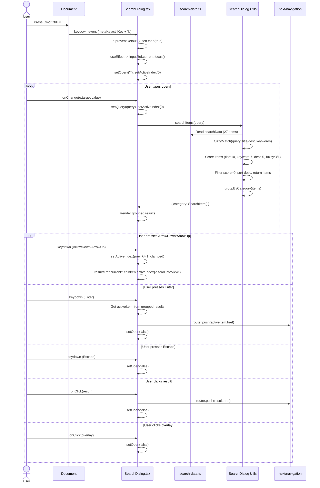
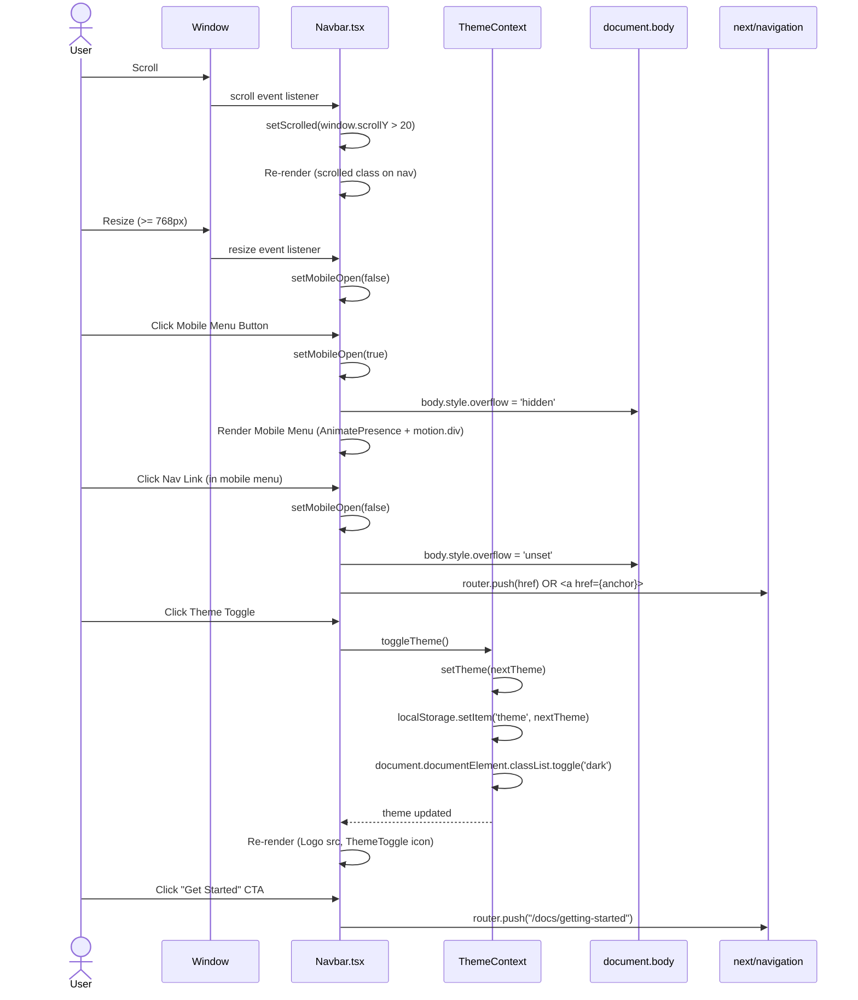
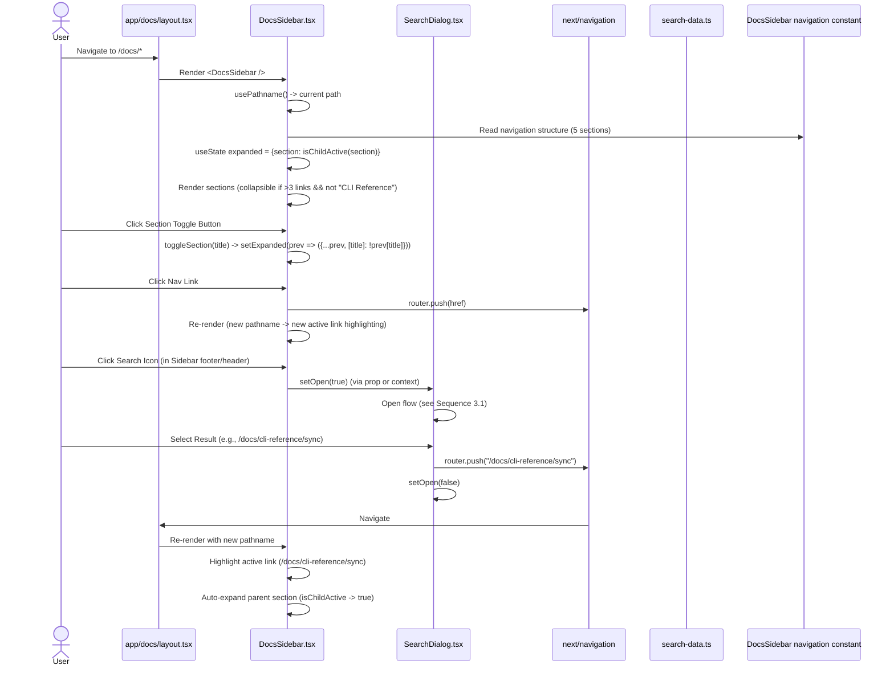
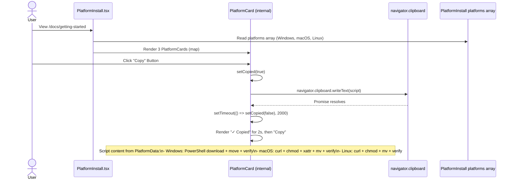

# System Diagrams

## 1. Component Diagram

```mermaid
graph TD
    %% Layout Components
    subgraph Layout["Layout Components"]
        Navbar["Navbar.tsx"]
        DocsSidebar["DocsSidebar.tsx"]
        Footer["Footer (inline in DocsSidebar)"]
    end

    %% Page Components
    subgraph Pages["Page Components"]
        Hero["Hero.tsx"]
        QuickStart["QuickStart.tsx"]
        PlatformInstall["PlatformInstall.tsx"]
    end

    %% UI Components
    subgraph UI["UI Components (src/components/ui/)"]
        Button["Button.tsx"]
        Card["Card.tsx + CardHeader/CardTitle/CardDescription"]
        Button["Button.tsx"]
        Card["Card.tsx"]
        CardHeader["CardHeader.tsx"]
        CardTitle["CardTitle.tsx"]
        CardDescription["CardDescription.tsx"]
        Button["Button.tsx"]
        Card["Card.tsx"]
        Logo["Logo.tsx"]
        ThemeToggle["ThemeToggle.tsx (from theme context)"]
    end

    %% Interactive Components
    subgraph Interactive["Interactive Components"]
        SearchDialog["SearchDialog.tsx"]
        PlatformCard["PlatformCard (in PlatformInstall.tsx)"]
        TerminalDemo["TerminalDemo (in Hero.tsx & QuickStart.tsx)"]
    end

    %% Visual Components
    subgraph Visual["Visual Components"]
        Galaxy["Galaxy.tsx (React Three Fiber)"]
        StarField["StarField (in Galaxy.tsx)"]
        SpiralNebula["SpiralNebula (in Galaxy.tsx)"]
        GalacticCore["GalacticCore (in Galaxy.tsx)"]
        BlueStreaks["BlueStreaks (in Galaxy.tsx)"]
    end

    %% Data & Utilities
    subgraph Data["Data & Utilities"]
        SearchData["search-data.ts (searchData, SearchItem)"]
        SearchUtils["SearchDialog.tsx (fuzzyMatch, searchItems, groupByCategory)"]
        FormatUtils["format.ts (formatTokens, formatUsd, formatPct)"]
        SearchData["search-data.ts"]
        SearchUtils["SearchDialog.tsx (search utils)"]
        FormatUtils["format.ts"]
    end

    %% Context & Hooks
    subgraph Context["Context & Hooks"]
        ThemeContext["ThemeContext (useTheme, ThemeToggle)"]
        SearchHooks["SearchDialog hooks (useState, useRef, useRouter, useEffect)"]
        ScrollHooks["Hero.tsx (useScroll, useTransform)"]
    end

    %% Pages / Routes
    subgraph Routes["Routes (Next.js App Router)"]
        Home["app/page.tsx (Home)"]
        DocsLayout["app/docs/layout.tsx"]
        DocsPages["app/docs/**/*.mdx"]
        DocsGettingStarted["app/docs/getting-started/page.tsx"]
        DocsCLI["app/docs/cli-reference/**"]
        DocsChangelog["app/docs/changelog/**"]
    end

    %% External
    subgraph External["External Dependencies"]
        NextJS["Next.js 15 (App Router)"]
        React["React 19"]
        FramerMotion["framer-motion"]
        ThreeFiber["@react-three/fiber"]
        Drei["@react-three/drei"]
        Three["three"]
        FramerMotion["framer-motion"]
        NextLink["next/link"]
        NextLink["next/link"]
        NextDynamic["next/dynamic"]
        NextNavigation["next/navigation"]
        FramerMotion["framer-motion"]
        ThreeFiber["@react-three/fiber"]
        Drei["@react-three/drei"]
        Three["three"]
    end

    %% Layout Composition
    Home --> Hero
    Home --> QuickStart
    Home --> Navbar
    DocsLayout --> DocsSidebar
    DocsLayout --> DocsPages
    DocsGettingStarted --> PlatformInstall
    DocsGettingStarted --> DocsSidebar
    DocsCLI --> DocsSidebar
    DocsChangelog --> DocsSidebar

    %% Component Composition
    Hero --> Galaxy
    Hero --> Logo
    Hero --> TerminalDemo
    Hero --> NextLink
    Hero --> ThemeContext
    Hero --> ScrollHooks
    Hero --> FramerMotion

    QuickStart --> TerminalDemo
    QuickStart --> NextLink
    QuickStart --> FramerMotion

    PlatformInstall --> PlatformCard
    PlatformInstall --> SearchHooks
    PlatformCard --> Button

    Navbar --> Logo
    Navbar --> ThemeToggle
    Navbar --> NextLink
    Navbar --> FramerMotion
    Navbar --> ThemeContext

    DocsSidebar --> NextLink
    DocsSidebar --> NextNavigation
    DocsSidebar --> SearchDialog
    DocsSidebar --> SearchHooks

    SearchDialog --> SearchData
    SearchDialog --> SearchUtils
    SearchDialog --> NextNavigation
    SearchDialog --> SearchHooks

    Galaxy --> StarField
    Galaxy --> SpiralNebula
    Galaxy --> GalacticCore
    Galaxy --> BlueStreaks
    Galaxy --> ThreeFiber
    Galaxy --> Drei
    Galaxy --> Three

    StarField --> Three
    SpiralNebula --> Three
    GalacticCore --> Three
    BlueStreaks --> Three

    Card --> CardHeader
    Card --> CardTitle
    Card --> CardDescription

    Button --> NextLink
    Logo --> ThemeContext
    ThemeToggle --> ThemeContext

    SearchDialog --> SearchData
    SearchDialog --> SearchUtils

    Hero --> NextDynamic
    Hero --> Galaxy

    %% External Dependencies
    Home --> NextJS
    Hero --> React
    Hero --> FramerMotion
    Hero --> ThreeFiber
    Hero --> Drei
    Hero --> Three
    Navbar --> NextJS
    Navbar --> React
    Navbar --> FramerMotion
    DocsSidebar --> NextJS
    DocsSidebar --> React
    SearchDialog --> NextJS
    SearchDialog --> React
    Galaxy --> ThreeFiber
    Galaxy --> Drei
    Galaxy --> Three
    Hero --> NextDynamic
    Hero --> NextLink
    Hero --> NextNavigation
    SearchDialog --> NextNavigation
    DocsSidebar --> NextNavigation
    Navbar --> NextLink
    QuickStart --> NextLink
    PlatformInstall --> React
    PlatformCard --> React
    Button --> React
    Card --> React
    Logo --> React
    ThemeToggle --> React
    SearchDialog --> React
    Hero --> React
    QuickStart --> React
    Galaxy --> React
    StarField --> React
    SpiralNebula --> React
    GalacticCore --> React
    BlueStreaks --> React
```



## 2. Data Flow Diagram

```mermaid
flowchart TD
    subgraph UserInput["User Input"]
        Keyboard["Keyboard Input (Cmd/Ctrl+K)"]
        MouseClick["Mouse Click (Search, Nav, Theme)"]
        Scroll["Scroll Events"]
        Resize["Window Resize"]
        Touch["Touch/Mobile Menu"]
    end

    subgraph InputHandlers["Input Handlers"]
        SearchKeydown["SearchDialog: keydown (Cmd/Ctrl+K)"]
        SearchInput["SearchDialog: onChange (query)"]
        SearchKeydownNav["SearchDialog: keydown (Esc, Arrows, Enter)"]
        NavClick["Navbar: onClick (links, theme, menu)"]
        SidebarClick["DocsSidebar: onClick (links, toggle)"]
        SearchClick["SearchDialog: onClick (results, overlay)"]
        ScrollHandler["Hero: useScroll / Navbar: scroll listener"]
        ResizeHandler["Navbar: resize listener"]
        MobileMenuClick["Navbar: mobile menu toggle"]
        ThemeToggleClick["ThemeToggle: onClick"]
        PlatformCopy["PlatformCard: copy script"]
        TerminalAnimation["Hero/QuickStart: scroll-triggered animation"]
    end

    subgraph State["State Management"]
        SearchState["SearchDialog: query, activeIndex, open"]
        NavbarState["Navbar: scrolled, mobileOpen"]
        SidebarState["DocsSidebar: expanded sections"]
        ThemeState["ThemeContext: theme (light/dark/system)"]
        HeroScrollState["Hero: scrollYProgress (0-1)"]
        PlatformCopyState["PlatformCard: copied (boolean)"]
        GalaxyTheme["Galaxy: isDark (from theme)"]
    end

    subgraph Data["Data Sources"]
        SearchData["search-data.ts: searchData (27 items)"]
        NavData["DocsSidebar: navigation structure"]
        PlatformData["PlatformInstall: platforms array"]
        FormatUtils["format.ts: formatTokens, formatUsd, formatPct"]
        SearchUtils["SearchDialog: fuzzyMatch, searchItems, groupByCategory"]
        NavStructure["DocsSidebar: navigation constant"]
        GalaxyConfig["Galaxy.tsx: particle configs (counts, colors, sizes)"]
        TerminalContent["Hero/QuickStart: static terminal content"]
    end

    subgraph Processing["Processing / Computation"]
        SearchFilter["SearchDialog: searchItems(query) -> scored results"]
        SearchGroup["SearchDialog: groupByCategory(results)"]
        FuzzyMatch["SearchDialog: fuzzyMatch(query, text)"]
        ScrollTransform["Hero: useTransform(scrollY -> y, opacity)"]
        GalaxyAnimation["Galaxy: useFrame -> rotation delta"]
        StarFieldAnim["StarField: rotation y+=0.008*delta, x+=0.003*delta"]
        SpiralAnim["SpiralNebula: rotation y+=0.025*delta"]
        CoreAnim["GalacticCore: rotation y-=0.04*delta"]
        StreaksAnim["BlueStreaks: rotation y+=0.035*delta"]
        ThemeDerived["ThemeContext: resolvedTheme (light/dark)"]
        ActiveSection["DocsSidebar: isChildActive(pathname)"]
        CollapsibleLogic["DocsSidebar: isCollapsible(section)"]
    end

    subgraph Rendering["Rendering Output"]
        SearchModal["SearchDialog: Modal + Input + Grouped Results"]
        NavbarUI["Navbar: Logo, Links, ThemeToggle, GitHub, CTA, Mobile Menu"]
        SidebarUI["DocsSidebar: Collapsible Sections, Active Link Highlight"]
        HeroUI["Hero: Galaxy BG, Logo, Headline, CTAs, Animated Terminal"]
        GalaxyCanvas["Galaxy: Canvas + 4 Particle Systems"]
        QuickStartUI["QuickStart: Static Terminal Demo + CTA"]
        PlatformUI["PlatformInstall: 3 PlatformCards with Copy Buttons"]
        TerminalUI["Terminal: Static Lines + Blinking Cursor"]
        ThemeClass["HTML: class='dark' / class=''"]
        FormatOutput["format.ts: formatted strings (tokens, USD, %)"]
    end

    subgraph External["External / Side Effects"]
        Clipboard["navigator.clipboard.writeText()"]
        RouterPush["router.push(href)"]
        BodyLock["document.body.style.overflow = 'hidden'"]
        ThemeClass["document.documentElement.classList.toggle('dark')"]
        LocalStorage["localStorage.setItem('theme', theme)"]
        GalaxyWebGL["WebGL Canvas (Three.js)"]
        FramerAnim["Framer Motion Animations"]
    end

    %% Flow: User Input -> Handlers
    Keyboard --> SearchKeydown
    MouseClick --> NavClick
    MouseClick --> SidebarClick
    MouseClick --> SearchClick
    MouseClick --> ThemeToggleClick
    MouseClick --> PlatformCopy
    MouseClick --> MobileMenuClick
    Scroll --> ScrollHandler
    Resize --> ResizeHandler
    Touch --> MobileMenuClick

    %% Flow: Handlers -> State
    SearchKeydown --> SearchState
    SearchInput --> SearchState
    SearchKeydownNav --> SearchState
    NavClick --> NavbarState
    NavClick --> ThemeState
    SidebarClick --> SidebarState
    SearchClick --> SearchState
    ScrollHandler --> HeroScrollState
    ScrollHandler --> NavbarState
    ResizeHandler --> NavbarState
    MobileMenuClick --> NavbarState
    ThemeToggleClick --> ThemeState
    PlatformCopy --> PlatformCopyState
    TerminalAnimation --> HeroScrollState

    %% Flow: State + Data -> Processing
    SearchState --> SearchFilter
    SearchData --> SearchFilter
    SearchFilter --> SearchGroup
    SearchState --> FuzzyMatch
    SearchData --> FuzzyMatch
    HeroScrollState --> ScrollTransform
    GalaxyTheme --> GalaxyAnimation
    GalaxyTheme --> StarFieldAnim
    GalaxyTheme --> SpiralAnim
    GalaxyTheme --> CoreAnim
    GalaxyTheme --> StreaksAnim
    ThemeState --> ThemeDerived
    ThemeDerived --> GalaxyTheme
    SidebarState --> ActiveSection
    NavStructure --> CollapsibleLogic
    ActiveSection --> SidebarState

    %% Flow: Processing -> Rendering
    SearchGroup --> SearchModal
    SearchState --> SearchModal
    NavbarState --> NavbarUI
    ThemeState --> NavbarUI
    ThemeState --> ThemeClass
    SidebarState --> SidebarUI
    NavStructure --> SidebarUI
    HeroScrollState --> HeroUI
    ScrollTransform --> HeroUI
    GalaxyAnimation --> GalaxyCanvas
    StarFieldAnim --> GalaxyCanvas
    SpiralAnim --> GalaxyCanvas
    CoreAnim --> GalaxyCanvas
    StreaksAnim --> GalaxyCanvas
    ThemeDerived --> HeroUI
    ThemeDerived --> GalaxyCanvas
    ThemeDerived --> Logo
    TerminalContent --> TerminalUI
    HeroScrollState --> TerminalUI
    PlatformData --> PlatformUI
    PlatformCopyState --> PlatformUI
    FormatUtils --> FormatOutput
    TerminalContent --> QuickStartUI
    TerminalContent --> HeroUI

    %% Flow: Rendering -> External
    SearchModal --> RouterPush
    SearchModal --> Clipboard
    NavbarUI --> RouterPush
    NavbarUI --> BodyLock
    NavbarUI --> ThemeClass
    SidebarUI --> RouterPush
    HeroUI --> RouterPush
    HeroUI --> FramerAnim
    GalaxyCanvas --> GalaxyWebGL
    PlatformUI --> Clipboard
    PlatformUI --> RouterPush
    ThemeClass --> LocalStorage
    ThemeClass --> ThemeClass
    FormatOutput --> TerminalUI
    FormatOutput --> QuickStartUI
```



## 3. Sequence Diagrams

### 3.1 Search Dialog Open & Search Flow



### 3.2 Hero Section Scroll Animation & Galaxy Render

```mermaid
sequenceDiagram
    actor User
    participant Hero as Hero.tsx
    participant Galaxy as Galaxy.tsx
    participant StarField as StarField
    participant SpiralNebula as SpiralNebula
    participant GalacticCore as GalacticCore
    participant BlueStreaks as BlueStreaks
    participant ThreeFiber as @react-three/fiber
    participant FramerMotion as framer-motion

    User->>Hero: Page Load
    Hero->>Hero: useTheme() -> theme (dark/light)
    Hero->>Hero: isDark = theme === 'dark'
    Hero->>Galaxy: <Galaxy isDark={isDark} /> (dynamic import, no SSR)
    Galaxy->>ThreeFiber: <Canvas camera={{position:[0,8,18],fov:55}} dpr={[1,2]} gl={{antialias:false,alpha:true}}>
    Galaxy->>StarField: <StarField isDark={isDark} />
    Galaxy->>SpiralNebula: <SpiralNebula isDark={isDark} />
    Galaxy->>GalacticCore: <GalacticCore isDark={isDark} />
    Galaxy->>BlueStreaks: <BlueStreaks isDark={isDark} />

    par StarField Init
        StarField->>StarField: useMemo -> positions[8000] (spherical, r=5-35)
        StarField->>StarField: useMemo -> PointMaterial (color, size, blending, opacity by isDark)
    and SpiralNebula Init
        SpiralNebula->>SpiralNebula: useMemo -> positions[4000] (3 arms, spiral, dist 0-14)
        SpiralNebula->>SpiralNebula: useMemo -> PointMaterial (color, size, opacity by isDark)
    and GalacticCore Init
        GalacticCore->>GalacticCore: useMemo -> positions[2000] (concentrated, r=0-8)
        GalacticCore->>GalacticCore: useMemo -> PointMaterial (color, size, opacity by isDark)
    and BlueStreaks Init
        BlueStreaks->>BlueStreaks: useMemo -> positions[1500] (12π spiral, r=3-15)
        BlueStreaks->>BlueStreaks: useMemo -> PointMaterial (color, size, opacity by isDark)
    end

    Hero->>Hero: useScroll({target:containerRef, offset:["start start","end start"]})
    Hero->>Hero: useTransform(scrollY, [0,1] -> y:[0,200], opacity:[1,0])
    Hero->>FramerMotion: <motion.div style={{y, opacity}}>

    loop Animation Frame (useFrame)
        ThreeFiber->>StarField: useFrame(({clock:{delta}}) => { ref.current.rotation.y += 0.008*delta; ref.current.rotation.x += 0.003*delta; })
        ThreeFiber->>SpiralNebula: useFrame(({clock:{delta}}) => { ref.current.rotation.y += 0.025*delta; })
        ThreeFiber->>GalacticCore: useFrame(({clock:{delta}}) => { ref.current.rotation.y -= 0.04*delta; })
        ThreeFiber->>BlueStreaks: useFrame(({clock:{delta}}) => { ref.current.rotation.y += 0.035*delta; })
    end

    User->>Hero: Scroll
    Hero->>Hero: scrollYProgress updated (0 to 1)
    Hero->>FramerMotion: y = 0->200, opacity = 1->0
    FramerMotion-->>Hero: Animated content transform
```

### 3.3 Navbar Scroll & Mobile Menu Flow



### 3.4 Docs Sidebar Navigation & Search Integration



### 3.5 Platform Install Copy Flow

