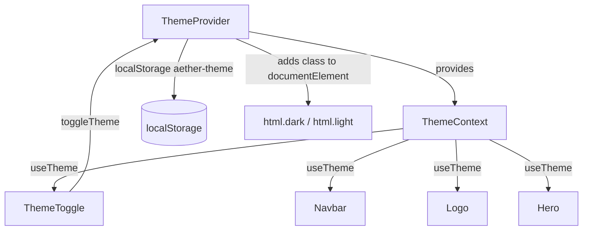

# Theme System

## Overview

The theme system provides dark/light mode switching. It is implemented through a React context provider, a hook to read theme state, and a toggle button component. Theme preference is persisted in `localStorage` and applied as a CSS class on the document root.

## Components and Files

| File | Export / Symbol | Role |
|------|----------------|------|
| `src/components/theme/ThemeProvider.tsx` | `ThemeProvider`, `useTheme` | Provides theme state, persists to `localStorage`, applies CSS class to `<html>` |
| `src/components/theme/ThemeToggle.tsx` | `ThemeToggle` | Button that calls `toggleTheme` to switch mode |
| `src/components/theme/index.ts` | re-exports `ThemeProvider`, `useTheme`, `ThemeToggle` | Barrel export for theme module |

## ThemeProvider Implementation

`ThemeProvider` (in `src/components/theme/ThemeProvider.tsx`) does the following:

- Defines `type Theme = "dark" | "light"`.
- Creates `ThemeContext` with default value `{ theme: "dark", toggleTheme: () => {} }`.
- `useTheme()` returns `useContext(ThemeContext)`.
- Initial state: `useState<Theme>("dark")` and `useState(false)` for `mounted`.
- On mount (`useEffect`), sets `mounted` to `true` and reads `localStorage.getItem("aether-theme")`; if a stored value exists, `setTheme(stored)`.
- A second `useEffect` runs when `theme` or `mounted` changes: if mounted, it removes `"dark"` and `"light"` classes from `document.documentElement`, adds the current `theme` class, and writes `localStorage.setItem("aether-theme", theme)`.
- `toggleTheme` flips `theme` between `"dark"` and `"light"`.

The root layout (`src/app/layout.tsx`) wraps children in `<ThemeProvider>` and sets `<html lang="en" className="dark" suppressHydrationWarning>`.

## ThemeToggle Implementation

`ThemeToggle` (in `src/components/theme/ThemeToggle.tsx`):

- Uses `useTheme()` to get `theme` and `toggleTheme`.
- Renders a `<button>` with `onClick={toggleTheme}`.
- Shows a sun SVG when `theme === "light"` and a moon SVG when `theme === "dark"`, using conditional opacity/rotation/scale classes.
- `aria-label` is `Switch to ${theme === "dark" ? "light" : "dark"} mode`.

## How Components Consume Theme State

Components access theme via `useTheme()` or via the `theme` value to pick assets/logos:

| Component | File | Consumption |
|-----------|------|-------------|
| `Navbar` | `src/components/navbar/Navbar.tsx` | `const { theme } = useTheme();` selects `/topbar_logo_dark.png` (dark) or `/topbar_logo_light.png` (light) |
| `Logo` | `src/components/ui/Logo.tsx` | `const { theme } = useTheme();` selects `/aether_logo_no_bg_dark.png` (dark) or `/aether_logo_no_bg.png` (light) |
| `Hero` | `src/components/hero/Hero.tsx` | `const { theme } = useTheme(); const isDark = theme === "dark";` passed to `<Galaxy isDark={isDark} />` |
| `DocsHeader` | `src/components/docs/DocsHeader.tsx` | Imports `ThemeToggle` from `@/components/theme` and renders it |
| `Navbar` | `src/components/navbar/Navbar.tsx` | Imports `ThemeToggle, useTheme` from `@/components/theme` and renders `<ThemeToggle />` |

## CSS Variable Consumption

Theme-dependent styling is applied via CSS variables (e.g. `var(--background)`, `var(--docs-bg)`, `var(--accent)`). These variables are referenced in component styles but their definitions are **not present** in the provided context (no `globals.css` content was supplied). Components that use them include:

- `src/app/layout.tsx`: `bg-background text-foreground` classes
- `src/app/docs/layout.tsx`: `style={{ background: "var(--docs-bg)" }}`
- `src/components/docs/DocsHeader.tsx`: `var(--docs-bg)`, `var(--docs-border)`, `var(--docs-heading)`, `var(--muted)`
- `src/components/docs/DocsSidebar.tsx`: `var(--docs-heading)`, `var(--accent)`, `var(--muted)`, `var(--docs-active)`, `var(--docs-active-border)`, `var(--docs-border)`
- `src/components/docs/PlatformInstall.tsx`: `var(--docs-border)`, `var(--docs-code-bg)`, `var(--background)`, `var(--docs-text)`
- `src/components/theme/ThemeToggle.tsx`: hover classes `dark:hover:bg-white/[0.06] light:hover:bg-black/[0.04]`

The actual mapping of `dark`/`light` classes to variable values is not verifiable from the provided files.

## Data Flow

