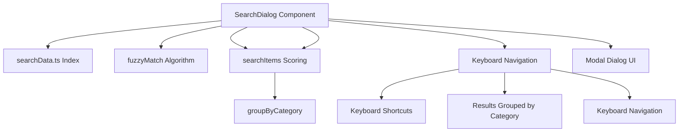
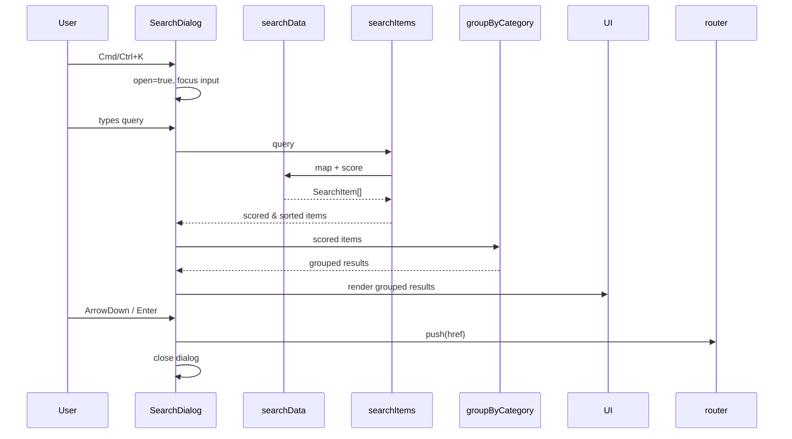

# Client-Side Search Implementation

## Overview

The `SearchDialog` component provides a client-side fuzzy search interface for documentation using a pre-built search index (`searchData.ts`). It is a modal dialog triggered by a global keyboard shortcut (`Cmd/Ctrl+K`) with keyboard navigation and fuzzy matching.

---

## Architecture



---

## Search Index (`src/lib/search-data.ts`)

**File**: `src/lib/search-data.ts`

```typescript
interface SearchItem {
  title: string;
  description: string;
  href: string;
  category: string;
  keywords: string[];
}

export const searchData: SearchItem[] = [ /* 27 items */ ];
```

| Category | Items | Example Items |
|----------|-------|---------------|
| Getting Started | 2 | Get Started, Quick Start |
| CLI Reference | 10 | Config, Genesis, Sync, Prompt, Ask, Clean, Exclude, CleanCode |
| Changelog | 12 | v0.2.1 … v0.1.0 |
| Community | 1 | GitHub |

Each `SearchItem` contains:
- `title` — display title
- `description` — short description
- `href` — target URL
- `category` — grouping category
- `keywords` — additional search keywords

---

## Search Algorithm

### Fuzzy Matching (`fuzzyMatch`)

```typescript
function fuzzyMatch(query: string, text: string): boolean {
  const q = query.toLowerCase();
  const t = text.toLowerCase();
  let i = 0;
  for (const char of t) {
    if (char === q[i]) i++;
    if (i === q.length) return true;
  }
  return false;
}
```

- Returns `true` if all query characters appear in order within the text (case-insensitive).
- Used as a fallback when exact/keyword matches fail.

### Scoring (`searchItems`)

```typescript
function searchItems(query: string): SearchItem[] {
  const q = query.toLowerCase().trim();
  if (!q) return [];

  return searchData
    .map((item) => {
      let score = 0;
      const title = item.title.toLowerCase();
      const desc = item.description.toLowerCase();
      const keywords = item.keywords.map((k) => k.toLowerCase());

      if (title === q) score += 10;
      if (keywords.includes(q)) score += 7;
      if (desc.includes(q)) score += 5;
      if (fuzzyMatch(q, title)) score += 3;
      if (fuzzyMatch(q, desc)) score += 1;

      return { ...item, score };
    })
    .filter((item) => item.score > 0)
    .sort((a, b) => b.score - a.score);
}
```

| Match Type | Score |
|------------|-------|
| Exact title match | +10 |
| Keyword match | +7 |
| Description substring | +5 |
| Fuzzy title match | +3 |
| Fuzzy description match | +1 |

Results filtered to `score > 0`, sorted descending by score.

### Grouping (`groupByCategory`)

```typescript
function groupByCategory(items: SearchItem[]): Record<string, SearchItem[]> {
  return items.reduce((acc, item) => {
    (acc[item.category] = acc[item.category] || []).push(item);
    return acc;
  }, {} as Record<string, SearchItem[]>);
}
```

Groups scored results by `category` for grouped rendering.

---

## Component: `SearchDialog` (`src/components/docs/SearchDialog.tsx`)

### Props

```typescript
interface SearchDialogProps {
  open: boolean;
  onOpenChange: (open: boolean) => void;
}
```

### State & Refs

| State/Ref | Purpose |
|-----------|---------|
| `query` | Current search input |
| `activeIndex` | Highlighted result index |
| `inputRef` | Focus management |
| `resultsRef` | Scroll container for active item |
| `router` | Navigation via `next/navigation` |

### Keyboard Shortcuts

| Key | Action |
|-----|--------|
| `Cmd/Ctrl+K` (global) | Toggle dialog open/close |
| `Escape` | Close dialog |
| `ArrowUp` / `ArrowDown` | Navigate results |
| `Enter` | Navigate to selected result |

Global listener attached on mount:

```typescript
useEffect(() => {
  const handleKeyDown = (e: KeyboardEvent) => {
    if ((e.metaKey || e.ctrlKey) && e.key === 'k') {
      e.preventDefault();
      onOpenChange(!open);
    }
  };
  document.addEventListener('keydown', handleKeyDown);
  return () => document.removeEventListener('keydown', handleKeyDown);
}, [open, onOpenChange]);
```

### Focus & Scroll Management

- On open: `inputRef.current?.focus()`
- On query change: `activeIndex` reset to 0
- On navigation: `resultsRef.current?.querySelector('[data-active]')?.scrollIntoView({ block: 'nearest' })`

### Click Outside to Close

```typescript
useEffect(() => {
  const handleClickOutside = (e: MouseEvent) => {
    if (resultsRef.current && !resultsRef.current.contains(e.target as Node)) {
      onOpenChange(false);
    }
  };
  if (open) document.addEventListener('mousedown', handleClickOutside);
  return () => document.removeEventListener('mousedown', handleClickOutside);
}, [open, onOpenChange]);
```

### Rendering

- Modal overlay with backdrop blur
- Search input with `Cmd/Ctrl+K` hint
- Results grouped by category (from `groupByCategory`)
- Each result: title, description, category badge
- Active item highlighted with `data-active` attribute
- Footer hints: `↑↓` navigate, `↵` select, `esc` close

---

## Integration Points

| Component | Role |
|-----------|------|
| `SearchDialog` | Consumer of `searchData`, exposes search UI |
| `searchData.ts` | Static search index (27 items, 4 categories) |
| `Navbar` / `DocsSidebar` | Likely consumers triggering `SearchDialog` open (not shown in provided files) |
| `next/navigation` | Client-side navigation on result selection |

---

## Data Flow



---

## Files Referenced

| File | Role |
|------|------|
| `src/components/docs/SearchDialog.tsx` | Search dialog component |
| `src/lib/search-data.ts` | Search index & types |
| `src/components/navbar/Navbar.tsx` | Likely trigger (not fully shown) |
| `src/components/docs/DocsSidebar.tsx` | Likely trigger (not fully shown) |