# MDX Documentation Structure

## Overview

Documentation pages are organized as MDX files under `src/app/docs/` with custom components registered via `mdx-components.tsx`. The structure is inferred from navigation links in `src/components/docs/DocsSidebar.tsx` and search index entries in `src/lib/search-data.ts`.

## Directory Structure (Inferred)

```
src/
├── app/
│   └── docs/
│       ├── page.mdx                          # /docs (index)
│       ├── getting-started/
│       │   └── page.mdx                      # /docs/getting-started
│       ├── cli-reference/
│       │   ├── page.mdx                      # /docs/cli-reference
│       │   ├── config/
│       │   │   └── page.mdx                  # /docs/cli-reference/config
│       │   ├── genesis/
│       │   │   └── page.mdx                  # /docs/cli-reference/genesis
│       │   ├── sync/
│       │   │   └── page.mdx                  # /docs/cli-reference/sync
│       │   ├── prompt/
│       │       └── page.mdx                  # /docs/cli-reference/prompt
│       │   ├── ask/
│       │       └── page.mdx                  # /docs/cli-reference/ask
│       │   ├── clean/
│       │       └── page.mdx                  # /docs/cli-reference/clean
│       │   ├── exclude/
│       │       └── page.mdx                  # /docs/cli-reference/exclude
│       │   └── cleancode/
│       │       └── page.mdx                  # /docs/cli-reference/cleancode
│       ├── proof/
│       │   └── page.mdx                      # /docs/proof
│       ├── changelog/
│       │   ├── page.mdx                      # /docs/changelog (index)
│       │   ├── v0.2.1/
│       │   │   └── page.mdx                  # /docs/changelog/v0.2.1
│       │   ├── v0.2.0/
│       │   │   └── page.mdx                  # /docs/changelog/v0.2.0
│       │   ├── v0.1.9/
      │   │   └── page.mdx                  # /docs/changelog/v0.1.9
      │   ├── v0.1.8/
      │   │   └── page.mdx                  # /docs/changelog/v0.1.8
      │   ├── v0.1.7/
      │   │   └── page.mdx                  # /docs/changelog/v0.1.7
      │   ├── v0.1.6/
      │   │   └── page.mdx                  # /docs/changelog/v0.1.6
      │   ├── v0.1.5/
      │   │   └── page.mdx                  # /docs/changelog/v0.1.5
      │   ├── v0.1.4/
      │   │   └── page.mdx                  # /docs/changelog/v0.1.4
      │   ├── v0.1.3/
      │   │   └── page.mdx                  # /docs/changelog/v0.1.3
      │   ├── v0.1.2/
      │   │   └── page.mdx                  # /docs/changelog/v0.1.2
      │   ├── v0.1.1/
      │   │   └── page.mdx                  # /docs/changelog/v0.1.1
      │   └── v0.1.0/
      │       └── page.mdx                  # /docs/changelog/v0.1.0
      └── community/
          └── page.mdx                      # /docs/community
├── components/
│   ├── docs/
│   │   ├── DocsSidebar.tsx                   # Navigation structure
│   │   ├── PlatformInstall.tsx               # Platform install component
│   │   ├── SearchDialog.tsx                  # Search dialog component
│   │   └── PlatformInstall.tsx               # Platform install component
│   ├── ui/
│   │   ├── Card.tsx                          # Card, CardHeader, CardTitle, CardDescription
│   │   ├── Button.tsx                        # Button component
│   │   ├── Card.tsx                          # Card component
│   │   └── Logo.tsx                          # Logo component
│   ├── hero/
│   │   └── Hero.tsx                          # Hero component
│   ├── navbar/
│   │   └── Navbar.tsx                        # Navbar component
│   ├── quickstart/
│   │   └── QuickStart.tsx                    # QuickStart component
│   ├── benchmarks/
│   │   └── format.ts                         # Format utilities
│   ├── galaxy/
    │   └── Galaxy.tsx                        # Galaxy component
    ├── hero/
    │   └── Hero.tsx                          # Hero component
    ├── navbar/
    │   └── Navbar.tsx                        # Navbar component
    ├── quickstart/
    │   └── QuickStart.tsx                    # QuickStart component
    ├── benchmarks/
    │   └── format.ts                         # Format utilities
    ├── galaxy/
    │   └── Galaxy.tsx                        # Galaxy component
    ├── hero/
    │   └── Hero.tsx                          # Hero component
    ├── navbar/
    │   └── Navbar.tsx                        # Navbar component
    ├── quickstart/
    │   └── QuickStart.tsx                    # QuickStart component
    ├── benchmarks/
    │   └── format.ts                         # Format utilities
    └── galaxy/
        └── Galaxy.tsx                        # Galaxy component
├── lib/
│   └── search-data.ts                        # Search index (27 items)
└── mdx-components.tsx                        # MDX component registry (inferred)
```

## Navigation Structure (from `DocsSidebar.tsx`)

| Section | Links |
|---------|-------|
| **Getting Started** | `/docs/getting-started` |
| **CLI Reference** | `/docs/cli-reference`, `/docs/cli-reference/config`, `/docs/cli-reference/genesis`, `/docs/cli-reference/sync`, `/docs/cli-reference/prompt`, `/docs/cli-reference/ask`, `/docs/cli-reference/clean`, `/docs/cli-reference/exclude`, `/docs/cli-reference/cleancode` |
| **Proof** | `/docs/proof` |
| **Changelog** | `/docs/changelog/v0.2.1` … `/docs/changelog/v0.1.0` (12 versions) |
| **Community** | `/docs/community` |

## Search Index Categories (from `search-data.ts`)

| Category | Items | Example Entries |
|----------|-------|-----------------|
| Getting Started | 2 | "Getting Started", "Quick Start" |
| CLI Reference | 10 | `/config`, `/genesis`, `/sync`, `/prompt`, `/ask`, `/clean`, `/exclude`, `/cleancode` |
| Changelog | 12 | v0.2.1 … v0.1.0 |
| Community | 1 | "Community" |

## Custom MDX Components (Inferred from `mdx-components.tsx`)

Based on components used in documentation pages and exported from `src/components/`:

| Component | Source | Usage Context |
|-----------|--------|---------------|
| `Card`, `CardHeader`, `CardTitle`, `CardDescription` | `src/components/ui/Card.tsx` | Documentation cards, feature cards |
| `Button` | `src/components/ui/Button.tsx` | CTAs, links |
| `PlatformInstall` | `src/components/docs/PlatformInstall.tsx` | Installation guides |
| `PlatformCard` | `src/components/docs/PlatformInstall.tsx` | Platform-specific install cards |
| `SearchDialog` | `src/components/docs/SearchDialog.tsx` | Search functionality |
| `Galaxy` | `src/components/galaxy/Galaxy.tsx` | Hero backgrounds |
| `Hero` | `src/components/hero/Hero.tsx` | Landing page hero |
| `QuickStart` | `src/components/quickstart/QuickStart.tsx` | Quick start demo |
| `Logo` | `src/components/ui/Logo.tsx` | Branding |
| `Navbar` | `src/components/navbar/Navbar.tsx` | Navigation |
| `DocsSidebar` | `src/components/docs/DocsSidebar.tsx` | Documentation sidebar |
| `formatTokens`, `formatUsd`, `formatPct` | `src/components/benchmarks/format.ts` | Benchmark formatting |

## Inferred `mdx-components.tsx` Structure

```tsx
// src/mdx-components.tsx (inferred)
import { Card, CardHeader, CardTitle, CardDescription } from '@/components/ui/Card'
import { Button } from '@/components/ui/Button'
import { PlatformInstall } from '@/components/docs/PlatformInstall'
import { SearchDialog } from '@/components/docs/SearchDialog'
import { Galaxy } from '@/components/galaxy/Galaxy'
import { Hero } from '@/components/hero/Hero'
import { QuickStart } from '@/components/quickstart/QuickStart'
import { Logo } from '@/components/ui/Logo'
import { Navbar } from '@/components/navbar/Navbar'
import { DocsSidebar } from '@/components/docs/DocsSidebar'
import { formatTokens, formatUsd, formatPct } from '@/components/benchmarks/format'

export const mdxComponents = {
  // Layout
  Card,
  CardHeader,
  CardTitle,
  CardDescription,
  
  // Interactive
  Button,
  PlatformInstall,
  SearchDialog,
  
  // Visual
  Galaxy,
  Hero,
  QuickStart,
  Logo,
  Navbar,
  DocsSidebar,
  
  // Utilities
  formatTokens,
  formatUsd,
  formatPct,
  
  // HTML overrides (inferred)
  h1: (props) => <h1 className="text-4xl font-bold mb-4" {...props} />,
  h2: (props) => <h2 className="text-3xl font-semibold mb-3 mt-8" {...props} />,
  h3: (props) => <h3 className="text-2xl font-medium mb-2 mt-6" {...props} />,
  p: (props) => <p className="text-muted-foreground mb-4" {...props} />,
  code: (props) => <code className="bg-muted px-1.5 py-0.5 rounded text-sm font-mono" {...props} />,
  pre: (props) => <pre className="bg-muted p-4 rounded-lg overflow-x-auto" {...props} />,
  a: (props) => <a className="text-primary underline-offset-2 hover:underline" {...props} />,
  ul: (props) => <ul className="list-disc list-inside mb-4 space-y-1" {...props} />,
  ol: (props) => <ol className="list-decimal list-inside mb-4 space-y-1" {...props} />,
  li: (props) => <li className="text-muted-foreground" {...props} />,
  blockquote: (props) => <blockquote className="border-l-4 border-primary pl-4 italic text-muted-foreground my-4" {...props} />,
  table: (props) => <table className="w-full border-collapse mb-4" {...props} />,
  th: (props) => <th className="border border-border p-2 text-left font-semibold" {...props} />,
  td: (props) => <td className="border border-border p-2" {...props} />,
}
```

## Mermaid: Documentation Architecture

```mermaid
graph TD
    A[src/app/docs/] --> B[page.mdx]
    A --> C[getting-started/page.mdx]
    A --> D[cli-reference/]
    A --> E[proof/page.mdx]
    A --> F[changelog/]
    A --> G[community/page.mdx]
    
    D --> D1[page.mdx]
    D --> D2[config/page.mdx]
    D --> D3[genesis/page.mdx]
    D --> D4[sync/page.mdx]
    D --> D5[prompt/page.mdx]
    D --> D6[ask/page.mdx]
    D --> D7[clean/page.mdx]
    D --> D8[exclude/page.mdx]
    D --> D9[cleancode/page.mdx]
    
    F --> F1[page.mdx]
    F --> F2[v0.2.1/page.mdx]
    F --> F3[v0.2.0/page.mdx]
    F --> F4[v0.1.9/page.mdx]
    F --> F5[v0.1.8/page.mdx]
    F --> F6[v0.1.7/page.mdx]
    F --> F7[v0.1.6/page.mdx]
    F --> F8[v0.1.5/page.mdx]
    F --> F9[v0.1.4/page.mdx]
    F --> F10[v0.1.3/page.mdx]
    F --> F11[v0.1.2/page.mdx]
    F --> F12[v0.1.1/page.mdx]
    F --> F13[v0.1.0/page.mdx]
    
    H[src/mdx-components.tsx] --> I[Custom Components]
    I --> J[UI Components: Card, Button, Logo]
    I --> K[Doc Components: PlatformInstall, SearchDialog, DocsSidebar]
    I --> L[Visual: Galaxy, Hero, QuickStart]
    I --> M[Utilities: formatTokens, formatUsd, formatPct]
    I --> N[HTML Overrides: h1-h3, p, code, pre, a, ul, ol, table]
    
    O[src/components/docs/DocsSidebar.tsx] --> P[Navigation Structure]
    P --> Q[Getting Started]
    P --> R[CLI Reference - 9 links]
    P --> S[Proof]
    P --> T[Changelog - 12 versions]
    P --> U[Community]
    
    V[src/lib/search-data.ts] --> W[Search Index: 27 items]
    W --> X[Getting Started: 2]
    W --> Y[CLI Reference: 10]
    W --> Z[Changelog: 12]
    W --> AA[Community: 1]
```



## Key Patterns

1. **File-based routing**: Each `.mdx` file under `src/app/docs/` maps to a route via Next.js App Router
2. **Sidebar-driven navigation**: `DocsSidebar.tsx` defines the canonical navigation structure
3. **Search index alignment**: `search-data.ts` mirrors sidebar structure with 27 indexed items
4. **Component composition**: MDX pages compose custom components registered in `mdx-components.tsx`
5. **Component reuse**: Shared UI components (`Card`, `Button`, `PlatformInstall`) used across docs pages